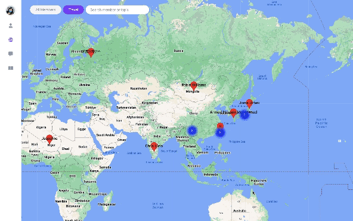
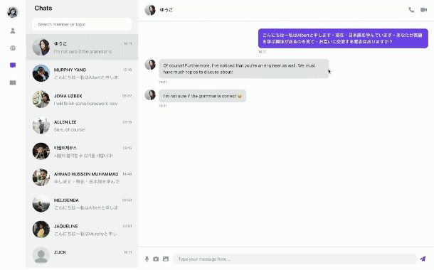
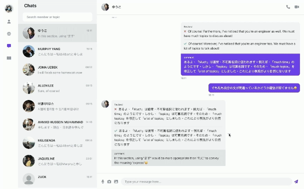

# LINGUOLINK

A language exchange web application where users can look for learning partners across the world, engage in chat rooms for messaging and corrections, and enhance user interactions with video chats.
 

- Enabled real-time video calls by utilizing WebRTC's P2P structure and integrating ICE and SDP technologies.
- Utilized Google Maps API to allow users to locate others which also showcases the total number of users in specific regions.
- Used Zustand for state management, ensuring a single data source and a consistent and predictable state.
- Implemented Firebase Authentication for user identity verification.
- Designed data structures and utilized Cloud Firestore as the database.
- Implemented products based on the Agile software development framework - Scrum, and utilizing Trello for project management.
   
   

## Base

- React
- Tailwind CSS
- Zustand
- Firebase
- Cloud Firestore
- WebRTC
- Google Maps API

## Demo

- On the community page, choose to browse all users or search for users using the map.

- Correct your chat partner's sentences or save unfamiliar words in chatroom.

 
 

## Contect

  
  
